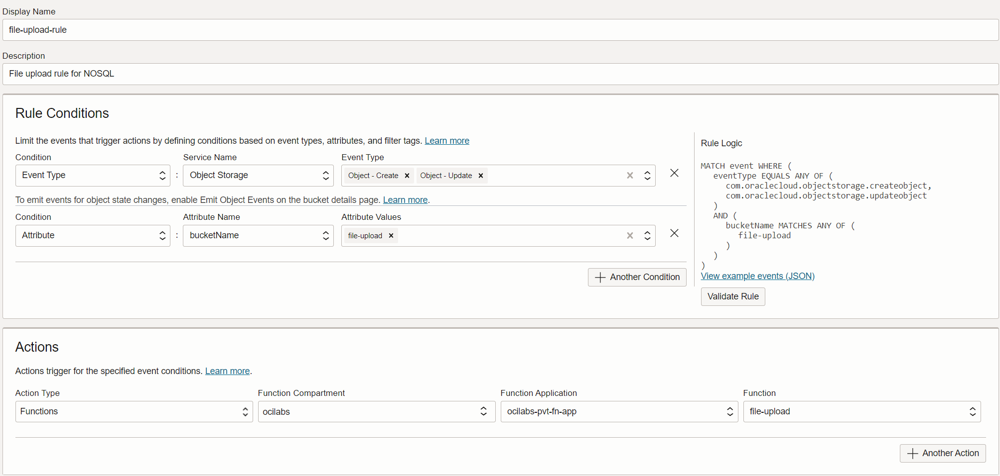
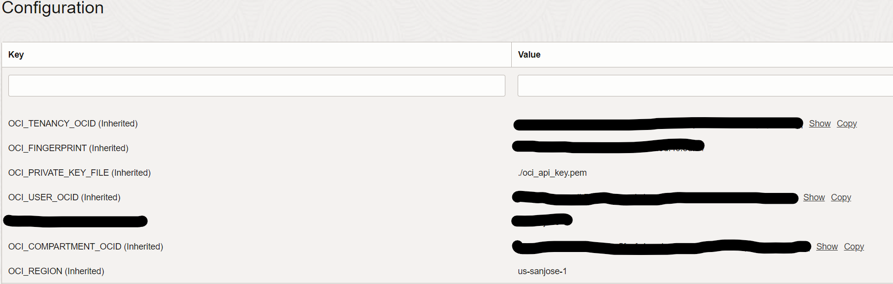

# oci-fn-nosql - OCI Function for updating NoSQL table upon Object Upload

[](https://img.shields.io/badge/license-UPL-green) [](https://sonarcloud.io/dashboard?id=oracle-devrel_oci-fn-nosql)

## Introduction
This function leverages Resource Principals for secure authorization, allowing the function to utilize the [OCI Python SDK](https://docs.oracle.com/en-us/iaas/tools/python/2.105.0/) for making API calls to OCI services. It retrieves the content of an uploaded object from an Object Storage bucket and reads the data and updates the NoSQL table. Please note that additional processing logic can be added as needed to process the data and update the target table.

The function calls the following OCI Python SDK classes:
* [Resource Principals Signer](https://docs.oracle.com/en-us/iaas/tools/python/2.105.0/) to authenticate
* [Object Storage Client](https://oracle-cloud-infrastructure-python-sdk.readthedocs.io/en/latest/api/object_storage/client/oci.object_storage.ObjectStorageClient.html) to interact with Object Storage
* [OCI Nosql Client](https://docs.oracle.com/en-us/iaas/tools/python/2.104.3/api/nosql/client/oci.nosql.NosqlClient.html) to publish message to stream endpoint

### Prerequisites
1.  Setup your Functions application and create the NoSQL table(person)

2. Please gather the following information. These values are required to configure the environment variables for function application
    * User ID  – The OCID of the user to authenticate with.
    * Tenancy ID  – Tenancy OCID. Can be found in user profile.
    * Fingerprint  – Will be used to authenticate to the OCI API.
    * Region – Identifier of the region to create the requests in.    
    * API private key  - API private key file location 
      Please ensure that the API key file (oci_api_key.pem) is included in the function package, following the function configuration example provided.
    * Compartment OCID - Compartment OCID where NoSQL table is created
    * NoSQL table - Create the sample table **person** with the following attributes. 
      | Primary Key  |  Column name | Type | 
      |---|---|---|      
      | Yes | id| INTEGER|
      | No | name| STRING|
      | No | age| INTEGER|
      | No | gender| STRING|

## Configuration

1.  Event Rule configuration
    
    

1.  Function configuration
    
    


## List Applications 

Assuming you have successfully completed the prerequisites, you should see your 
application in the list of applications.

```
fn ls apps
```


## Create or Update Dynamic Group for OCI function

In order to use other OCI Services, your function must be part of a dynamic 
group. For information on how to create a dynamic group, refer to the 
[documentation](https://docs.cloud.oracle.com/iaas/Content/Identity/Tasks/managingdynamicgroups.htm#To).

When specifying the *Matching Rules*, we suggest matching all functions in a compartment with:

```
ALL {resource.type = 'fnfunc', resource.compartment.id = 'ocid1.compartment.oc1..aaaaaxxxxx'}
```


## Required IAM Policies

Create a new policy that allows the dynamic group to `read objects` in
the functions related compartment.


Your policy should look something like this:
```
Allow dynamic-group <dynamic-group name> to read objects in compartment <compartment-name>
```
e.g.
```
Allow dynamic-group oci-streaming-fn-dyn-group to read objects in compartment ocilabs-fn-compartment
```

For more information on how to create policies, go [here](https://docs.cloud.oracle.com/iaas/Content/Identity/Concepts/policysyntax.htm).


## Required files to build and deploy OCI function

Review the following files in the current folder:

- [requirements.txt](./requirements.txt) specifies all the dependencies for your function
- [func.yaml](./func.yaml) that contains metadata about your function and declares properties
- [func.py](./func.py) which is your actual Python function

The name of your function *file-upload* is specified in [func.yaml](./func.yaml).


## Deploy the function

In Cloud Shell, run the *fn deploy* command to build the function and its dependencies as a Docker image, 
push the image to the specified Docker registry, and deploy the function to Oracle Functions 
in the application created earlier:

```
fn -v deploy --app <app-name>
```
e.g.
```
fn -v deploy --app myapp
```
## Test
To test this function, please follow the provided steps below.
  - Please make sure to enable the Function Invocation and event Rule execution logs.

  - Upload **person.json** to the object storage bucket that is configured in the event rule. 
    This action will trigger the event rule and initiate the execution of the associated function. 
    Please be aware that there may be a delay before the function execution logs become available for viewing.
  
  - Navigate to NoSQL table > Explore data screen and execute the select query to view the table data.

## Notes/Issues
* Customize the function code to meet specific business needs, like incorporating additional logic for data processing and applying conditions before updating the NoSQL table from object storage uploads.

## URLs
* Nothing at this time

## Contributing
This project is open source.  Please submit your contributions by forking this repository and submitting a pull request!  Oracle appreciates any contributions that are made by the open source community.

## License
Copyright (c) 2024 Oracle and/or its affiliates.

Licensed under the Universal Permissive License (UPL), Version 1.0.

See [LICENSE](LICENSE) for more details.

ORACLE AND ITS AFFILIATES DO NOT PROVIDE ANY WARRANTY WHATSOEVER, EXPRESS OR IMPLIED, FOR ANY SOFTWARE, MATERIAL OR CONTENT OF ANY KIND CONTAINED OR PRODUCED WITHIN THIS REPOSITORY, AND IN PARTICULAR SPECIFICALLY DISCLAIM ANY AND ALL IMPLIED WARRANTIES OF TITLE, NON-INFRINGEMENT, MERCHANTABILITY, AND FITNESS FOR A PARTICULAR PURPOSE.  FURTHERMORE, ORACLE AND ITS AFFILIATES DO NOT REPRESENT THAT ANY CUSTOMARY SECURITY REVIEW HAS BEEN PERFORMED WITH RESPECT TO ANY SOFTWARE, MATERIAL OR CONTENT CONTAINED OR PRODUCED WITHIN THIS REPOSITORY. IN ADDITION, AND WITHOUT LIMITING THE FOREGOING, THIRD PARTIES MAY HAVE POSTED SOFTWARE, MATERIAL OR CONTENT TO THIS REPOSITORY WITHOUT ANY REVIEW. USE AT YOUR OWN RISK. 